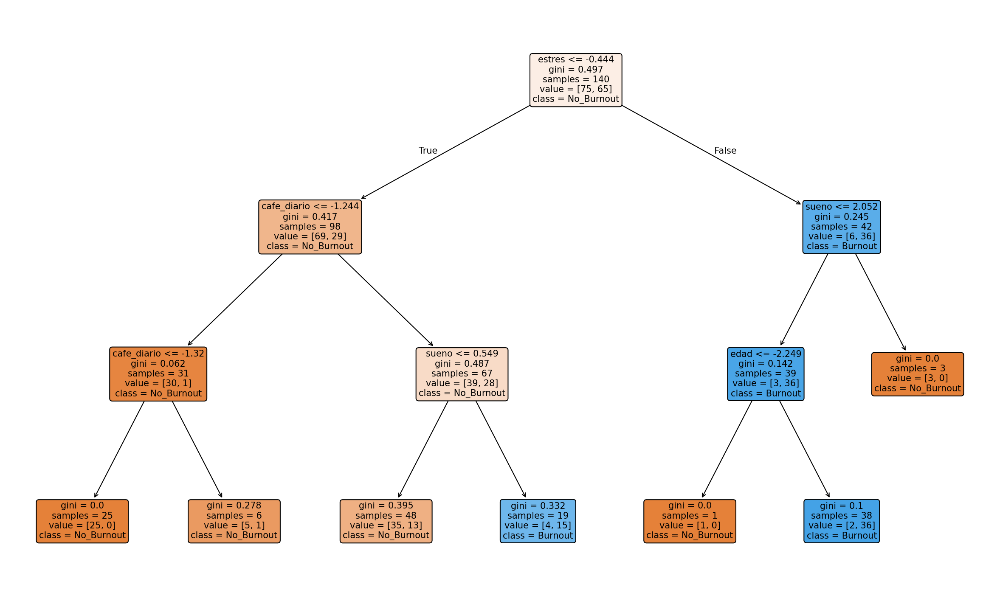

# ml-magda-dia16
# 🚀 Día 16: Decision Trees VISUALES

**Burnout Predictor | Jupyter Notebook | Features ordenadas**

## 📊 Results

| Modelo | Accuracy |
|--------|----------|
| Decision Tree | **71.66%** |(Not great, still learning)

## 🏆 TOP 3 Features
1. **estres**: 47.59%
2. **sueno**: 31.01%
3. **cafe_diario**: 16.89%

## 📸 Visualizaciones



## 🛠️ Reproducir
```bash
pip install scikit-learn numpy matplotlib
jupyter notebook dia16_arbol.ipynb
